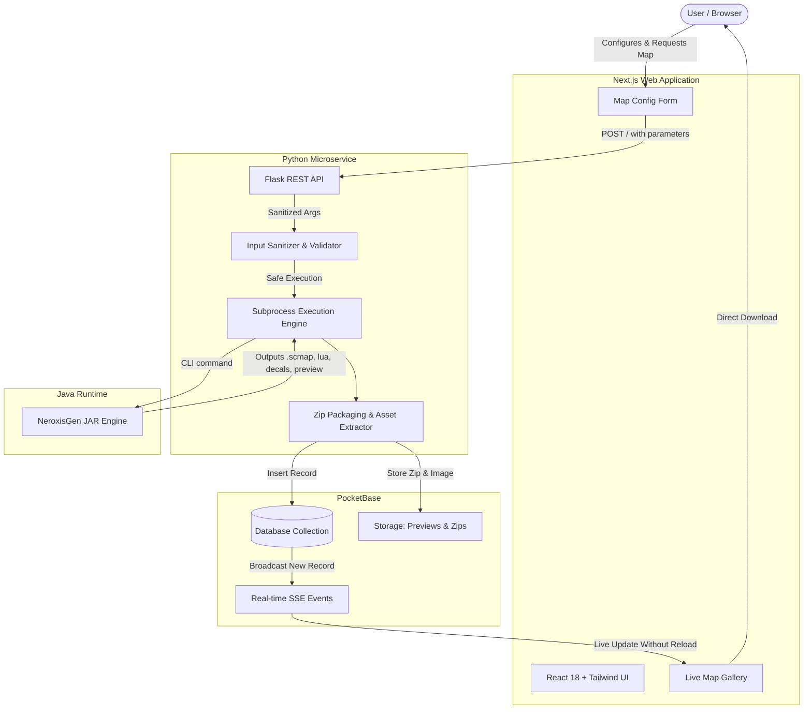

# 🛰️ Supreme Commander: Forged Alliance — Procedural Map Generator

[](https://nextjs.org/)
[](https://reactjs.org/)
[](https://tailwindcss.com/)
[](https://www.python.org/)
[](https://palletsprojects.com/p/flask/)
[](https://pocketbase.io/)
[](https://adoptium.net/)

A full-stack, polyglot web platform for procedurally generating and browsing custom maps for **Supreme Commander: Forged Alliance**. Powered by the battle-tested **Neroxis Map Generator**, a Python Flask microservice, a Next.js frontend with progressive blur image optimization, and PocketBase for real-time WebSocket synchronization.

---

## 📐 Architecture Overview



---

## ✨ Key Features

- **Procedural Generation On-Demand**: Configure spawn count (2–16 players), discrete map dimensions (5km to 20km), batch count, and terrain styles (`LAND_BRIDGE`, `BIG_ISLANDS`, `CENTER_LAKE`, `VALLEY`, etc.).
- **Real-Time Live Gallery**: Integrates PocketBase Server-Sent Events (`subscribe('*')`) to update the gallery instantly upon completion of map generation across all connected clients.
- **Secure by Design**: Input sanitization preventing OS Command Injections (`shell=False`, argument list isolation, boundary checks).
- **Automated Packaging**: Automatically parses Neroxis file output, compresses game scenario files into Forged Alliance-compliant `.zip` archives, and extracts preview PNGs.
- **Modern Responsive UI**: Dark futuristic aesthetics designed with Tailwind CSS, accessible modal dialogs, and smooth grayscale-to-color blur animations with `next/image`.
- **Isolated Workspace**: Generator executes inside isolated temporary batches without polluting repository root or server disk.

---

## 🛠️ Tech Stack

| Layer | Technology | Purpose |
|---|---|---|
| **Frontend** | Next.js 13, React 18, Tailwind CSS | Server-Side Rendering (SSR), UI components, responsive layout |
| **Backend API** | Python 3.11, Flask 3.0, Flask-CORS | Generation orchestration, validation, subprocess runner |
| **Engine** | Java 17, NeroxisGen CLI | Procedural heightmap, biome, mex, and prop generation |
| **BaaS / Storage** | PocketBase | SQLite relational metadata, file storage, real-time WebSocket events |
| **HTTP Client** | Axios | Frontend-to-backend form submission and error handling |

---

## 🚀 Quick Start

### 1. Prerequisites

Ensure you have the following installed on your system:
- [Node.js](https://nodejs.org/) (v18.0 or higher)
- [Python](https://www.python.org/) (v3.10 or higher)
- [Java Runtime Environment (JRE)](https://adoptium.net/) (Java 17 LTS recommended)
- [PocketBase](https://pocketbase.io/docs/) executable

---

### 2. Environment Configuration

Copy the example environment file and adjust if necessary:

```bash
cp .env.example .env
```

Default variables:
```ini
NEXT_PUBLIC_POCKETBASE_URL=http://127.0.0.1:8090
NEXT_PUBLIC_API_URL=http://127.0.0.1:5000
POCKETBASE_URL=http://127.0.0.1:8090
MAP_LIMIT_GENERATOR=10
PORT=5000
```

---

### 3. PocketBase Setup

1. Start PocketBase:
   ```bash
   ./pocketbase serve --http=127.0.0.1:8090
   ```
2. Access the Admin UI at `http://127.0.0.1:8090/_/` and create an admin account.
3. Create a collection named **`supremecommandermaps`** with the following fields:
   - `map_name` (Text)
   - `map_id` (Text)
   - `giocatori` (Text / Number)
   - `map_zip` (File - single file, allowed MIME: application/zip)
   - `map_img` (File - single file, allowed MIME: image/png, image/jpeg)
4. Set API rules for `supremecommandermaps` to public read (`""`) and create permissions according to your needs.

---

### 4. Backend Microservice Setup

```bash
# Install Python dependencies
pip install -r server/requirements.txt

# Start the Flask API server
python server/supremeCommanderMap.py
```
The server will start on `http://127.0.0.1:5000`.

---

### 5. Frontend Setup

```bash
# Install Node dependencies
npm install

# Run development server
npm run dev
```
Open [http://localhost:3000](http://localhost:3000) in your browser.

---

## 🧪 Testing & Code Quality

Run the automated backend test suite:
```bash
python -m unittest discover -s server
```

Run ESLint verification:
```bash
npm run lint
```

Build production bundle:
```bash
npm run build
```

---

## 📁 Project Structure

```
.
├── components/
│   ├── Form.js                 # Accessible form with terrain style and size presets
│   └── Modal.js                # Dialog component with clean backdrop and controls
├── lib/
│   └── serverConfig.js         # Centralized environment endpoint configuration
├── public/                     # Static assets (favicons, icons)
├── server/
│   ├── NeroxisGen_1.8.8.jar    # Java procedural generator binary
│   ├── requirements.txt        # Python backend dependencies
│   ├── supremeCommanderMap.py  # Flask microservice and subprocess controller
│   └── test_supreme_commander_map.py # Unit test suite with mock coverage
├── src/
│   ├── pages/
│   │   ├── _app.js             # Next.js App wrapper
│   │   ├── _document.js        # HTML Document layout
│   │   ├── _error.js           # Custom error boundary component
│   │   └── index.js            # Main gallery page with SSR & real-time SSE
│   └── styles/
│       └── globals.css         # Tailwind base and global CSS rules
├── .env.example                # Sample environment variables
├── .gitignore                  # Git ignore rules for node, python, maps & zips
├── package.json                # Frontend package configuration
└── README.md                   # Project documentation
```

---

## 🛡️ Security Highlights

- **CWE-78 Command Injection Prevention**: Subprocess calls avoid shell interpretation (`shell=False`) and pass arguments as discrete, strictly validated token lists.
- **Input Validation**: Numerical and string constraints enforce allowable bounds on player count (2–16), batch generation limits (1–10), and terrain style whitelist.
- **Resource Cleanup**: Safe temporary batch directory life cycles and auto-closing file handles avoid memory/file descriptor leaks.

---

## 📜 License

This project is open-source and available under the [MIT License](LICENSE).